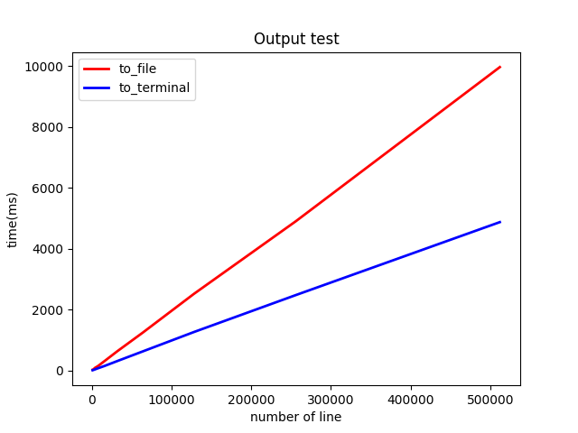
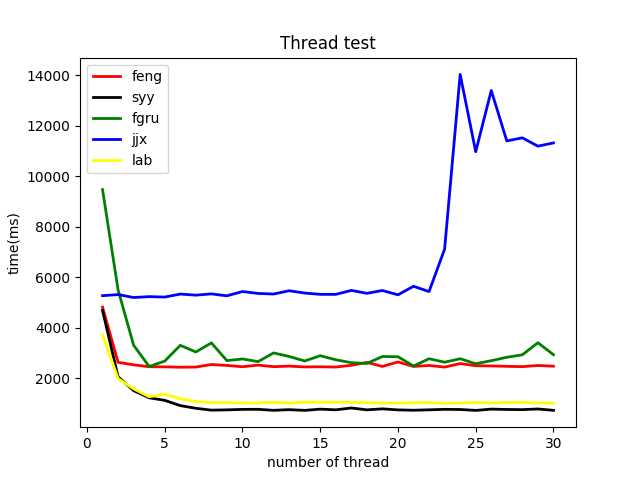
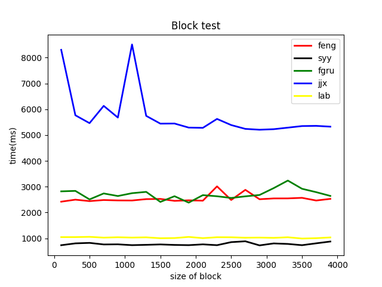
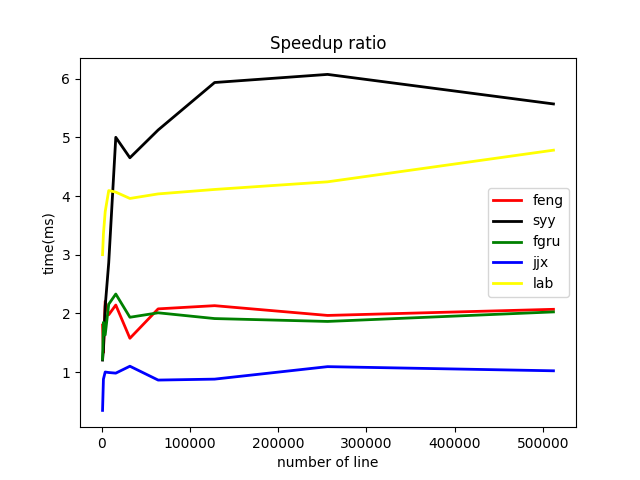

# Lab 1 Performance Report

*2019_nCoV_killers* 

## 实验内容

实现一个可以解决数独问题的程序，实验分为basic和advanced难度。

### 问题描述

多线程编程是高性能编程的技术之一，实验 1 将针对数独求解问题比较多线
程与单线程的性能差异、同一功能不同代码实现的性能差异以及多线程在不同硬
件环境下的性能差异。 

### 我们的工作

已经实现 advanced 级别，并且验证完毕，详细见正确性验证的部分。

### 算法

选择的是dance-link算法。在后面的结果对比和分析全部使用dancing link。

### 输入输出

#### 输入

1. 在程序运行时输入测试文件名
2. 可以输入多个文件名，输入时机随意
3. 可以输入任意大小的文件
4. 使用 ctrl-d 结束文件输入，当结果计算完成之后会自动退出程序。

#### 输出

默认情况下输出到屏幕

## 测试

### 测试方法

可以使用脚本`Lab1/test/test.sh`来一键式测试。详细信息在[说明文档](../test/README)中.最后运行的结果可以再`${usrid}_*.png`中看到

### 实验环境
|      |                     OS                     |                 CPU                 |         RAM          |
| :--: | :----------------------------------------: | :---------------------------------: | :------------------: |
| syy  | Ubuntu 18.04 bionic [Ubuntu on Windows 10] | Intel Core i7-7700HQ @ 8x 2.801 GHz | 7841 MiB / 12149 MiB |
| feng |            Ubuntu 18.04 bionic             |  Intel Xeon Gold 6161 @ 2x 2.2 Hz   | 1297 MiB / 3944 MiB  |
| fgru |            Ubuntu 16.04 xenial             |   Intel Core i7-8550U CPU @ 4 GHz   | 2013 MiB / 7768 MiB  |
| fgru |            Ubuntu 18.04 bionic             | Intel Core i7-7500U @ 4x 2.904 GHz  | 1537 MiB / 6071 MiB  |
| jjx  |            Ubuntu 18.04 bionic             |   Intel Core i5-7200U @ 2.712 GHz   |  969 MiB / 1894 MiB  |

*注：如果未说明，测试结果顺序也按此表格顺序列出。*

### 正确性测试

使用老师的代码输出标准答案，用我们的代码输出答案后使用diff来测试不同

1. 单文件小于100M，标准答案和我们的答案没有任何区别
2. 多文件的情况其中有测试文件达到**1g+**,标准答案的按文件顺序整合之后和我们的答案没有任何区别
3. 在多文件测试的时候由于输出太快了，直接输出不行。需要把输出重定向之后再输入文件名，发现可以任何时间输入并且结果与标准答案一致。

### 性能分析

#### 输出方式

*图一：在 feng 的机器中，将结果输出到屏幕或者重定向到文件，随着题目数量的增长，运行时间所产生的变化，其中横坐标是问题数量。*

看到直接输出到屏幕要比输出到文件中更快，可能是因为输出到disk要慢一点的缘故。

#### 线程数

*图二：在不同机器中，使用不同数量的线程进行题目的求解所需要的时间，这里的线程不包含输入输出线程*

本组的线程还加入了一点点负载均衡，保证每个线程都会**获得相对公平的压力**。

可以看到，大部分的机器，随着线程数量多的增加，运行时间不断减少，当到一定范围的时候出现拐点，然后时间趋于一个稳定状态。此拐点大致与机器的核个数相对应。jjx 的实验结果，则相反。

jjx的机器的实验结果相对反常，出现这个现象的原因：只有一个cpu核，所以随着线程增加，线程间的切换带来的开销不可忽略。所以反而效果越不好。

#### 读入块

*图三：在不同机器的实验环境下，一次性从文件中读入问题的个数与运行时间的关系，横坐标是题目数量*

这里的读入块有一个问题，就是如果和测试文件的大小吻合的比较好，则比较表现优秀。如果和测试文件大小吻合的不太好会稍微影响性能，但是都是在**每个问题平均影响在± 0.002ms左右所**以不是很大的问题。

同时可以看到由于内存的频率不同，所以每个人机器的表现不同。其中syy的内存是两条内存条构成了双通道，所以会比其他人快很多。

#### 加速比

*图四：在不同机器环境下，运行多线程的解数独程序与实验提供的默认版本相比，在不同问题规模下的加速比。横坐标是题目数量*

可以看到在问题规模小的时候问题数越多加速比越大，在问题规模增大到一定程度的时候发现加速比会下降。

可以看到(syy、lab)的加速比相近，(feng、fgru)相近。但是(syy、lab)和(feng、fgru)却有差异的原因分析为：(syy、lab)的物理核较多，在多线程下加速确实明显，所以多线程成为了性能突破的原因。而相对的(feng、fgru)的物理核心数目较少，所以多线程带来的收益不是很好。想要去优化的话需要对每个线程内操作流程进行进一步的优化才能提升更多。

另，由于jjx的机器是虚拟机，并且由于资源的紧缺而导致她仅仅分配了2g内存和一个cpu核。所以多线程由于线程切换带来的开销很大，并不能实际的并行从出现加速比无法超过1.
