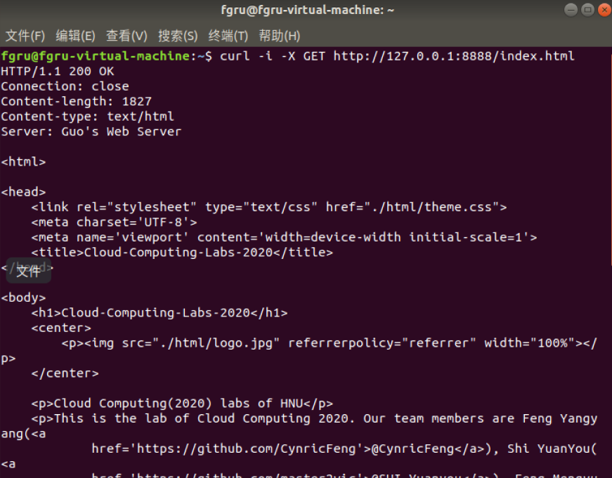
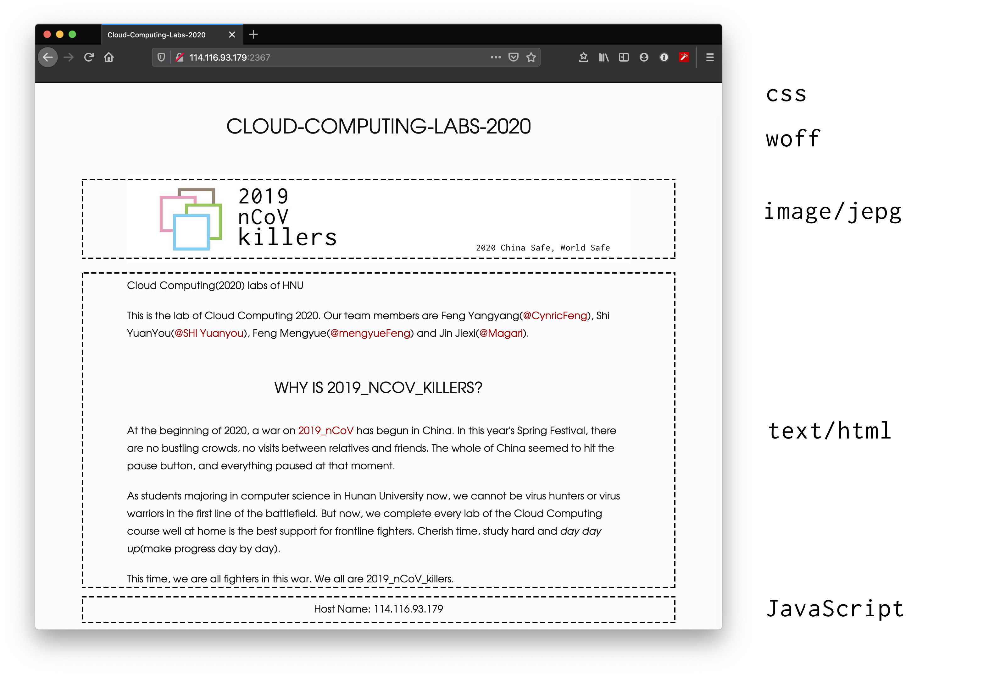
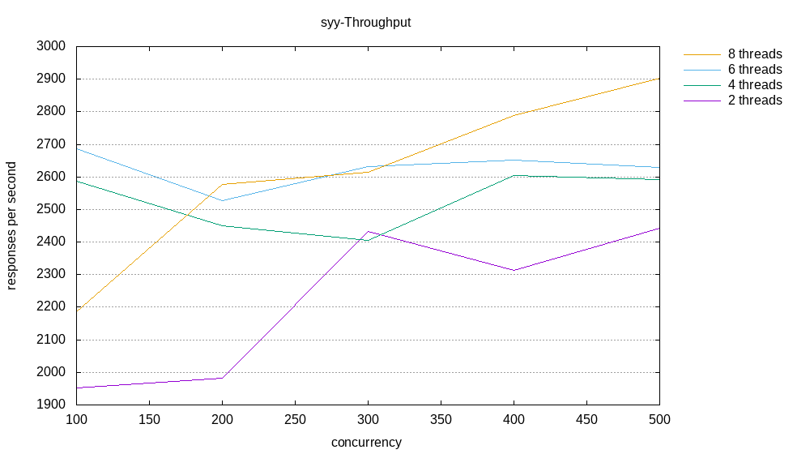

# Lab 2 Performance Report

*2019_nCoV_killers* 

## 实验内容

实现一个HTTP服务器，实验分为basic和advanced难度。

### 问题描述

从头开始构建基于HTTP / 1.1的HTTP服务器。并通过高并发编程技巧来保证Web服务器的性能。

### 我们的工作

已经实现 advanced 级别，并且验证完毕，详细见正确性验证的部分。

### 算法

使用多线程增加并发

## 测试

### 正确性测试

按照试验指导书的要求，测试如下

3.1.6

运行服务器

3.1.7.1

通过打开Web浏览器并转到相应的URL来检查HTTP服务器是否正常工作。

3.1.7.1.2

使用curl程序发送HTTP请求

3.1.7.1.3

果请求页面不存在，则HTTP服务器应返回404 Not Found错误消息

3.1.7.2.1

使用curl程序发送HTTP请求来检查POST方法是否有效

3.1.7.2.2

如果请求URL不是`/Post_show`或键不是“名称”和“ ID”），则会收到404 Not Found错误消息。

3.1.7.3

除GET请求和POST请求外，HTTP服务器将不处理HTTP请求。

### 性能测试

#### 测试方法

使用HTTP客户端测试工具ab-Apache HTTP服务器基准测试工具](http://httpd.apache.org/docs/current/programs/ab.html)。

测试了在不同的并发请求数、不同的客户请求数下

1. 在不同的计算机环境上运行服务器时，不同线程数的服务器的情况
2. 在多台计算机上运行客户端并同时访问另一台计算机上运行的服务端的情况
3. 在代理模式下不同的计算机环境上运行服务器时，不同线程数，不同客户访问情况

测试时使用的网站如下，包括css、woff、image/jepg和text/html

#### 实验环境

|      |                     OS                     |                 CPU                 |         RAM          |
| :--: | :----------------------------------------: | :---------------------------------: | :------------------: |
| syy  | Ubuntu 18.04 bionic [Ubuntu on Windows 10] | Intel Core i7-7700HQ @ 8x 2.801 GHz | 7841 MiB / 12149 MiB |
| fyy  |            Ubuntu 18.04 bionic             |  Intel Xeon Gold 6161 @ 2x 2.2 Hz   | 1297 MiB / 3944 MiB  |
| fmy  |            Ubuntu 18.04 bionic             | Intel Core i7-7500U @ 4x 2.904 GHz  | 1537 MiB / 6071 MiB  |
| jjx  |            Ubuntu 18.04 bionic             |   Intel Core i5-7200U @ 2.712 GHz   |  969 MiB / 1894 MiB  |

*注：如果未说明，测试结果顺序也按此表格顺序列出。*

#### 性能分析

##### 测试一

在以下3台服务器环境下，不同的服务器线程数，不同的并发访问量，服务器每秒可以处理HTTP请求数如下图

可以看到在不不断增大的并发访问量下，服务器每秒可以处理HTTP请求数最后趋于一个极限，随着服务器线程数的增加，服务器的处理能力提高，但当并发访问过多时，超出服务器的处理能力也有可能会导致服务器每秒可以处理HTTP请求数下降。同时，由于虚拟机的缘故，服务器每秒可以处理HTTP请求数也有较大差异。

##### 测试二

分别在jjx、fmy、fyy的计算机上运行客户端并同时访问syy计算机上运行的服务端，在不同的并发访问量下得到的服务器运行结果如下

在高测试并发测试下，当总访问量在500左右时，服务器每秒可以处理HTTP请求数达到最高越1000，但是当访问量继续增大，则造成服务器性能急剧下降。

##### 测试三

使用代理时，在以下3台服务器环境下，不同的服务器线程数，不同的并发访问量，服务器每秒可以处理HTTP请求数如下图

与不使用代理时服务器每秒可以处理HTTP请求数的变化类似，但是在高并发访问量的时候，相比不使用代理会造成更高的丢包率，更高的丢包会导致服务器看似每秒处理HTTP请求数增高，但根据低并发访问量的情况来看，还是在不使用代理时更快一些。

